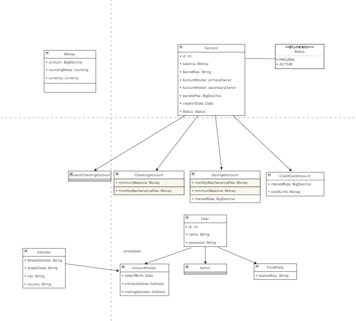

# Banking System

## Description
There are 2 types of users in this banking system:
- Admin: who can create all accounts, delete them and modify their status and balance.
- AccountHolder: who can consult the balance of his account.

There are 4 types of accounts and they all have their own special characteristics and attributes:

- Checking Accounts:
  - The minimum balance is 250.
  - The monthly maintenance fee is 12.

- Savings Account
  - The minimum balance must be between 100 and 1000.
  - Interest rate must be between 0 and 0.5.

- Credit Card Account
  - The credit limit is between 100 and 100000.
  - The interest rate must be between 0.1 and 0.2.

## Scalabilities

- That AccoultHolder can make money transfers.
- That ThirdParty to be able to transfer money.
- That StudentCheckingAccounts should be created if customers registering are under 24 years old.
- Admins can create accountholders.
- That the tests are applied correctly.
- And a long etcetera

## Class Diagram

## Technologies used
- SpringBoot
- Java
- MySQL
- Postman to check the HTTP requests.
